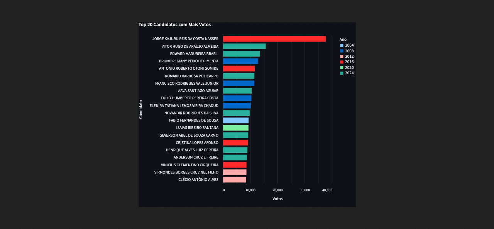

# 📊 Painel de Vereadores em Goiás (2004–2024)

Este painel interativo permite explorar os dados eleitorais de vereadores em todos os municípios de Goiás, entre os anos de 2004 e 2024.

Desenvolvido com **Python** e **Streamlit**, o painel permite filtrar os dados por ano, estado, município, partido e situação eleitoral.

## 🔍 Funcionalidades

- Filtros por ano, município, partido e situação
- Visualização dos candidatos com votos recebidos
- Ranking dos vereadores mais votados
- Gráfico de votos por partido
- Download direto das tabelas em Excel

## 📁 Fonte dos dados

Os dados utilizados neste painel foram organizados a partir dos resultados oficiais divulgados pelo TSE.

## 🚀 Acesse o painel online

👉 [Clique aqui para acessar o painel no Streamlit](https://painel-vereadores-goias.streamlit.app/)

## 💻 Como rodar localmente

1. Clone este repositório:
   ```bash
   git clone https://github.com/seuusuario/painel-vereadores-goias.git
   cd painel-vereadores-goias
   ```

2. Instale as dependências:
   ```bash
   pip install -r requirements.txt
   ```

3. Execute o app:
   ```bash
   streamlit run app.py
   ```

## 📎 Requisitos

- Python 3.9+
- Streamlit
- Pandas
- Altair
- openpyxl

> Este projeto foi desenvolvido como parte de um esforço de transparência e análise de dados eleitorais no estado de Goiás.
